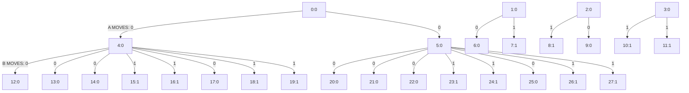

These are the possibilities:

```mermaid
graph TD;
    0[0:0] -- A MOVES: 0 --> 4[4:0];
    0[0:0] -- 0 --> 5[5:0];
    1[1:0] -- 0 --> 6[6:0];
    1[1:0] -- 1 --> 7[7:1];
    2[2:0] -- 1 --> 8[8:1];
    2[2:0] -- 0 --> 9[9:0];
    3[3:0] -- 1 --> 10[10:1];
    3[3:0] -- 1 --> 11[11:1];


    4[4:0] -- B MOVES: 0 --> 12[12:0];
    4[4:0] -- 0 --> 13[13:0];
    4[4:0] -- 0 --> 14[14:0];
    4[4:0] -- 1 --> 15[15:1];
    4[4:0] -- 1 --> 16[16:1];
    4[4:0] -- 0 --> 17[17:0];
    4[4:0] -- 1 --> 18[18:1];
    4[4:0] -- 1 --> 19[19:1];

    5[5:0] -- 0 --> 20[20:0];
    5[5:0] -- 0 --> 21[21:0];
    5[5:0] -- 0 --> 22[22:0];
    5[5:0] -- 1 --> 23[23:1];
    5[5:0] -- 1 --> 24[24:1];
    5[5:0] -- 0 --> 25[25:0];
    5[5:0] -- 1 --> 26[26:1];
    5[5:0] -- 1 --> 27[27:1];
```
